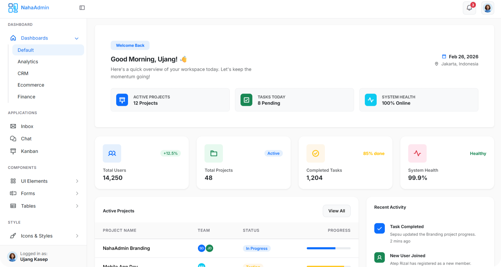

<div align="center">

# NahaAdmin — Free Bootstrap 5 Admin Dashboard



<br/>

**A clean, modern, and fully responsive admin dashboard template built on Bootstrap 5.**  
Drop it into any project — no build tools, no npm required.

[🚀 Live Demo](https://naha-admin.vercel.app/demo) · [📖 Documentation](https://naha-admin.vercel.app/docs) · [⬇️ Download](https://github.com/sepsu-dev/naha-admin/releases)

</div>

---

## ✨ Features

- **Bootstrap 5 Core** — Modern, clean design with customizable CSS variables.
- **4 Pre-built Dashboards** — Default, Analytics, CRM, E-Commerce, and Finance.
- **53+ Ready-to-Use Pages** — Auth pages, user profiles, error pages (400/401/403/404/500/503), and layout variations.
- **Phosphor Icons** — 900+ icons across bold, regular, and fill styles.
- **Smooth UI/UX** — Page progress bar via NProgress and entrance animations via Animate.css.
- **Rich Components** — Buttons, cards, modals, dropdowns, alerts, tooltips, progress bars, and advanced forms.
- **Data Tables** — High-performance tables with **DataTables** and **Grid.js**.
- **Zero Build Step** — Pure HTML + CSS + Vanilla JS. Works with any backend (Laravel, Django, Node.js, PHP).
- **SEO Optimized** — Pre-configured meta tags and Open Graph.

---

## 🚀 Quick Start

```bash
# Clone the repository
git clone https://github.com/sepsu-dev/naha-admin.git

# Serve locally (any static server works)
npx serve .
# or: php -S localhost:8000
# or: Open with VS Code Live Server
```

Navigate to `demo/index.html` to browse all pages.

---

## 📁 Folder Structure

```text
naha-admin/
├── assets/
│   ├── images/       # Logos, banners, user avatars, and UI graphics
│   ├── plugins/      # Third-party libraries (Bootstrap, Phosphor, NProgress, etc.)
│   ├── scripts/      # Custom scripts (naha-admin.min.js & page-specific scripts)
│   └── styles/       # Stylesheets (naha-admin.min.css & page-specific styles)
├── demo/             # 53+ static HTML pages ready for use
├── docs/             # Static documentation site
├── index.html        # Landing page
├── robots.txt        # Web crawler configuration
└── sitemap.xml       # Search engine sitemap
```

---

## 📄 License

Released under the [MIT License](LICENSE). Free for personal, client, and commercial use — no attribution required in your UI.